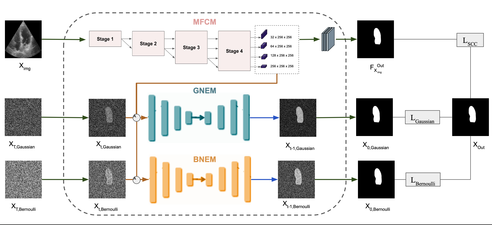

# Echo-DND: A Dual Noise Diffusion Model for Robust and Precise Left Ventricle Segmentation in Echocardiography

[-green?logo=springer&style=flat-square)](https://doi.org/10.1007/s42452-025-07055-5)
[]([https://www.arxiv.org/abs/xxxx.yyyy])
[](https://github.com/abdur75648/Echo-DND)
[](https://abdur75648.github.io/Echo-DND)

---

## 🧠 Overview
Accurate segmentation of the left ventricle (LV) in echocardiograms is crucial for cardiac diagnostics but is challenging due to inherent noise, low contrast, and ambiguous boundaries in ultrasound images. This repository accompanies our paper introducing **Echo-DND**, a novel diffusion probabilistic model (DPM) specifically designed to address these challenges.

Echo-DND introduces several key innovations:
*   A **Synergistic Dual-Noise Strategy:** Uniquely combines Gaussian and Bernoulli noises within the diffusion framework, effectively modeling both continuous sensor-like variations and the discrete binary nature of segmentation masks.
*   A **Multi-scale Fusion Conditioning Module (MFCM):** Employs multi-resolution feature extraction and cross-resolution fusion to preserve high-resolution spatial details, crucial for precise boundary delineation.
*   **Spatial Coherence Calibration (SCC):** Incorporates a pixel-wise calibration technique that complements the diffusion process to maintain spatial integrity and consistency in the output segmentation masks.

Our model was rigorously validated on the public CAMUS and EchoNet-Dynamic datasets, demonstrating state-of-the-art performance and establishing a new benchmark in echocardiogram LV segmentation. Echo-DND's architecture holds promise for broader applicability in other medical imaging tasks.

---

## 🖼️ Architecture

<p align="center">
  
</p>

> *Figure: Overall architecture of the Echo-DND model, illustrating the dual noise (Gaussian and Bernoulli) diffusion pathways, the Multi-scale Fusion Conditioning Module (MFCM), and the integration of various loss components including Spatial Coherence Calibration (SCC).*

---

## 📦 Code Availability

> 🚧 Code coming soon...

We are currently in the process of cleaning up and preparing the codebase and model weights for public release. We aim to make them available in this repository to facilitate further research and reproducibility. Please stay tuned for updates!

---

## 📄 Citation

If you find this work useful, please consider citing:

```bibtex
@article{Rahman2025EchoDND,
  author    = {Rahman, Abdur and Balraj, Keerthiveena and Ramteke, Manojkumar and Rathore, Anurag Singh},
  title     = {Echo-DND: a dual noise diffusion model for robust and precise left ventricle segmentation in echocardiography},
  journal   = {Discover Applied Sciences},
  volume    = {7},
  number    = {514},
  year      = {2025},
  month     = {May},
  doi       = {10.1007/s42452-025-07055-5},
  url       = {https://doi.org/10.1007/s42452-025-07055-5},
  publisher = {Springer Nature}
}
